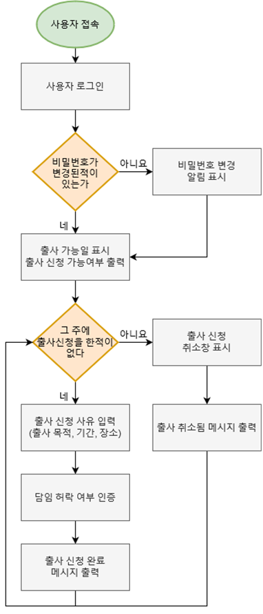
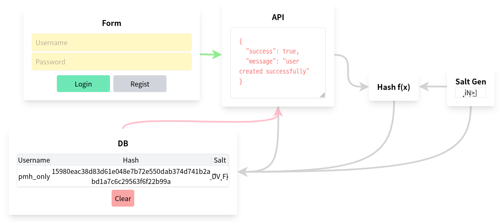
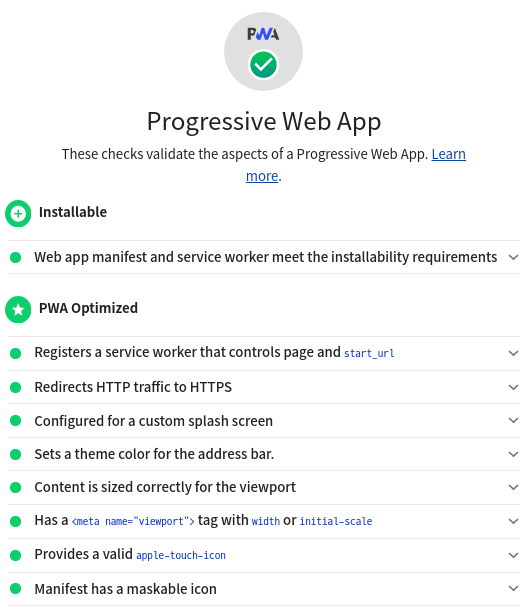
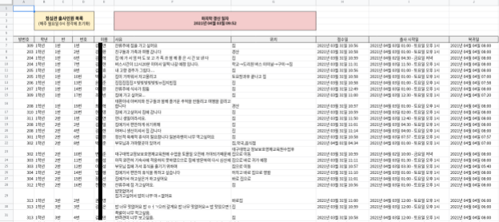

# GBSWHS/Jongsimgwan-outgo
경북소프트웨어고등학교 정심관(기숙사) 잔류 인원 확인 시스템

> 개발 및 설치 관련은 [이곳](./docs/DEVELOPMENT.md)에 서술되어 있습니다.

## 목차
- [GBSWHS/Jongsimgwan-outgo](#gbswhsjongsimgwan-outgo)
  - [목차](#목차)
  - [Ⅰ. 프로젝트 실행 동기 및 목적](#ⅰ-프로젝트-실행-동기-및-목적)
  - [Ⅱ. 이론적 배경(기존 사례)](#ⅱ-이론적-배경기존-사례)
  - [Ⅲ. 프로젝트 방법 및 과정](#ⅲ-프로젝트-방법-및-과정)
    - [1. 개발 순서 구상](#1-개발-순서-구상)
    - [2. 사용 기술 선정](#2-사용-기술-선정)
    - [3. 데이터베이스 설계](#3-데이터베이스-설계)
    - [4. 보안 설계](#4-보안-설계)
    - [5. 기능 구현](#5-기능-구현)
    - [6. 진행형 웹 애플리케이션(PWA) 구현](#6-진행형-웹-애플리케이션pwa-구현)
    - [7. 웹 서버 구축](#7-웹-서버-구축)
  - [Ⅳ. 프로젝트 결과](#ⅳ-프로젝트-결과)
  - [Ⅴ. 결론 및 고찰](#ⅴ-결론-및-고찰)
  - [▣ 참고문헌](#-참고문헌)

## Ⅰ. 프로젝트 실행 동기 및 목적
본교는 원칙적으로 기숙사 잔류 주와 의무 출사 주를 번갈아 운영하는 격주제를 진행한다. 하지만 피치 못할 사정이 있는 경우 잔류 주에도 출사를 신청할 수 있다. 기존의 출사 신청 방식은 담임선생님의 지도로 거수와 문답을 통해 출사 여부를 수집하는 것이다. 하지만 이는 불필요한 시간을 낭비하고 전산화하기 힘든 단점이 있다.

이러한 문제점을 소프트웨어적으로 해결하여 쉽고 간편하게 출사 신청을 할 수 있도록 하는 것이 좋을 거 같다는 여러 사람의 의견을 반영하여 이 프로젝트를 기획하게 되었다.

본 프로젝트는 기숙사 출사 가능 주(의무출사 주 외)에 거수 및 문답으로 출사 여부를 수집해야 하는 수고로움을 대체하여 쉽고 간단하게 출사 여부를 수집할 수 있는 웹 애플리케이션(Web Application)을 제작하는 것을 목적으로 한다.

## Ⅱ. 이론적 배경(기존 사례)
여러 소프트웨어 관련 학교들에서 이 프로젝트와 유사한 개발을 진행한 것으로 보이나, 현재 웹 개발 추세에 뒤처지는 것으로 보인다.

## Ⅲ. 프로젝트 방법 및 과정
### 1. 개발 순서 구상

출사 신청 과정을 어떻게 설계해야 사용자가 빠르고 쉽게 이용할 수 있을지 생각해보며 팀원 간 대화를 통해 사용자 진행 순서와 같게 개발 순서를 설계하였다.

먼저 사용자 로그인 기능을 구현해 사용자를 식별할 수 있도록 한다. 그 후 학번으로 설정된 초기 비밀번호를 변경해야 한다는 알림을 표시하도록 구현해 사용자가 새로운 비밀번호를 입력하도록 유도한다. 출사 가능일까지 남은 일수를 보여주어 사용자의 편리성을 높이도록 계획하였다. 출사 신청 사유는 목적과 기간, 장소를 입력하게 하여 정확한 정보를 수집하도록 계획하였다. 만약 사용자가 잘못된 정보를 입력했을 경우 취소할 수 있도록 출사 신청 취소 창도 계획하였다.

### 2. 사용 기술 선정
모바일 환경으로 접속하는 사용자가 많을 것으로 예상되므로 가볍고, 빠른 응답 및 처리 속도를 최우선으로 하여 팀원관 대화를 통해 사용 기술을 선정하였다.

DBMS로는 안정성과 확장성을 고려해 ‘MariaDB’를 사용하는 것으로 결정되었고[[참고 1](#-참고문헌)] 프론트엔드 프레임워크는 빠른 뷰 전환을 위하여 ‘Route’ 기능을 사용하기위해 ‘Next.js’를 사용하는 것으로 결정되었다.[[참고 2](#-참고문헌)]

프로그래밍 언어는 빠른 개발과 수준 높은 오류 검출을 위해 'TypeScript'를 사용하는것으로 하였다.[[참고 3](#-참고문헌)]

구글 API를 통해 구글 스프레드시트로 보여주도록 하여 한눈에 출사 신청 현황을 알 수 있도록 하자는 의견이 있어 반영하였다. 이는 'Node.js'를 통해 작업하는 것으로 하였다.[[참고 4](#-참고문헌)]

### 3. 데이터베이스 설계
차후 데이터베이스를 확장할 것을 고려하며 확장성을 중점으로 데이터베이스를 설계하였다. 다음은 이 프로젝트에서 사용한 데이터베이스의 테이블 정보를 서술한다.

먼저 사용자의 정보 및 비밀번호 저장을 담당하는 테이블이다.

`"user"테이블`
| 필드 | 자료형 | 설명 | 속성 |
|:----:|:------:|:----:|:-----|
| id | 가변형 문자열 | 학생 구분 ID (학번으로 구성됨) | PK(기본키), NN(null불가) |
| grade/class/num | 32비트 정수 | 학년 반 번호 | NN |
| roomno | 32비트 정수 | 호실 번호 (ex: 302) | NN |
| nickname | 고정형 문자열 | 학생 실명  | NN |
| passwd | 고정형 문자열 | salt값+비밀번호를 sha256한 값 | NN |
| salt | 고정형 문자열 | 무작위 8자 유니코드 문자 | NN |
| student | 8비트 정수 | 학생-담임선생님 구분 | (0: 선생님, 1: 학생) | NN, 기본값: 1 |

앞의 테이블에서 알 수 있듯이 비밀번호를 안전히 보관하기 위해 salt를 생성하여 혹시나 사용자가 드러나기 쉬운 비밀번호로 설정하더라도 유출이 쉽지 않게끔 설계하였다.[[참고 5](#-참고문헌)]

다음은 출사 정보를 저장하는 테이블이다.

`"outgo"테이블`
| 필드 | 자료형 | 설명 | 속성 |
|:----:|:------:|:----:|:----:|
| id | 가변형 문자열 |학생 구분 ID (학번으로 구성됨) |PK(기본키), NN(null불가) |
|reason |긴 문자열 |출사 사유 |NN |
|destination |긴 문자열 |출사 행선지 |NN |
|startdate |가변형 문자열 |출사 시작일 (YYMMDDhhmm)  |NN |
|enddate |가변형 문자열 |귀사일 (YYMMDDhhmm) |NN |
|outgodate |8비트 정수 |출사일 구분 |(0: 금요일 저녁, |1: 토요일 오후 1시) |NN, 기본값: 1 |
|created_at |Unix타임스탬프 |출사 신청일 |NN, 기본값: 현재시간 |

앞의 테이블에서 알 수 있듯이 출사와 관련된 여러 정보를 저장하여 쉽게 구분할 수 있도록 설계하였다.

### 4. 보안 설계
많은 개인정보를 다루는 프로젝트이므로 보안에 특히 신경을 썼다. 서버와의 모든 통신은 신뢰할 수 있는 CA 기관에서 발급한 SSL 위에서 진행되는 것으로 설계하였고[[참고 6](#-참고문헌)] 특히 로그인/비밀번호 변경 시 보안 해시 알고리즘을 사용하여 단방향 암호화하고[[참고 7](#-참고문헌)] 암호학적으로 안전한 난수 생성기를 사용하여 SALT 값을 구현하였다.[[참고 8](#-참고문헌)]

▲ 암호 알고리즘 시각화

### 5. 기능 구현
하교 이후 기숙사 자율시간을 활용하여 계획한 기능들을 구현하였다. 마이크로소프트사에서 개발한 “Visual Studio Code”에서 지원하는 "Live Share"기능을 사용하여 팀원들과 쉽고 빠르게 동시 작업하여 작업의 능률을 증가시켰다.[[참고 9](#-참고문헌)]

“React”의 “Component”방식을 활용해 스타일이나 구성 요소들을 재활용하는 등 속도 개선을 위하여 노력하였다.[[참고 10](#-참고문헌)]

"Tailwind.css"의 “PostCSS”기능을 활용해 같은 디자인이지만 불필요한 스타일링을 제거하여 웹 페이지의 용량을 줄였다.[[참고 11](#-참고문헌)]

SSR(서버 측 렌더링)과 SSG(정적 사이트 생성기)를 적절히 사용해 사용자 성능과 무관한 빠른 처리 속도를 구현하였다.[[참고 12](#-참고문헌)]

### 6. 진행형 웹 애플리케이션(PWA) 구현

사용자 대부분이 모바일 환경임을 고려해서 PWA로 바탕화면 아이콘을 통해 지연 없이 쉽고 간단하게 웹 사이트를 이용할 수 있도록 하였다.

모바일 환경에 최적화된 PWA를 제작하기 위해 구글에서 제공하는 &lt;PWA Checklist&gt;를 만족하도록 구현하였다.[[참고 13](#-참고문헌)]

### 7. 웹 서버 구축
교내에 컴퓨팅 자원이 많지 않아 Amazon에서 제공하는 AWS를 이용하여 클라우드 컴퓨팅을 통해 웹 서버를 구축하였다.[[참고 14](#-참고문헌)]

최소한의 요금으로 최대한의 요청을 수행할 수 있도록 NGINX와 PM2와 같은 소프트웨어를 활용하며 구축하였다.[[참고 15](#-참고문헌)]

## Ⅳ. 프로젝트 결과
다음은 사용자에게 보이는 화면(View) 목록이다. 모바일 친화적인 디자인과 직관적인 UI로 구성하였다. 또한 PWA구현으로 모바일 사용자에게 빠른 응답이 가능하다.

| | | |
|-|-|-|
|  ▲ 사용자 로그인 화면 |  ▲ 사용자 초기 비밀번호 변경 |  ▲ 메인페이지 (출사가능일 및 가능 여부 표시) |
|  ▲ 출사 사유 입력 화면(출사 사유, 행선지, 기간, 담임 인증 입력) |  ▲ PWA가 지원되는 환경에서의 로그인페이지 |  ▲ PWA앱 시작 화면 |

다음은 출사 인원을 한눈에 볼 수 있도록 제작된 스프레드시트이다.
학생들이 출사 신청을 할 때마다 자동으로 구글 스프레드시트에 적용된다.

## Ⅴ. 결론 및 고찰
이 프로젝트를 하면서 PWA의 원리와 장점에 대하여 알 수 있었다. 또한 모바일 친화적인 웹 디자인을 연구하는 계기가 되었고 사용자를 고려한 디자인에 대하여 생각해보는 시간이 되었다.

"Next.js"를 활용하여 빠른 화면(View)전환을 할 수 있는 기술을 학습하였다.

## ▣ 참고문헌
참고 1: MySQL vs MariaDB: Performance | MariaDB\
https://mariadb.com/kb/en/mariadb-vs-mysql-features/#speed-improvements

참고 2: Routing: Introduction | Next.js\
https://nextjs.org/docs/routing/introduction

참고 3: TypeScript: Typed JavaScript at Any Scale. | Microsoft\
https://www.typescriptlang.org/#index

참고 4: Node.js quickstart | Google Developers\
https://developers.google.com/sheets/api/quickstart/nodejs

참고 5: Hashing and Password Storage | Nomad Coders\
https://www.youtube.com/watch?v=67UwxR3ts2E

참고 6: Introducing Universal SSL | Cloudflare\
https://blog.cloudflare.com/introducing-universal-ssl/

참고 7: Secure Hash Algorithms | Wikipedia\
https://en.wikipedia.org/wiki/Secure_Hash_Algorithms

참고 8: Generate a cryptographically strong random string | crypto-random-string \
https://github.com/sindresorhus/crypto-random-string#readme

참고 9: Introducing Visual Studio Live Share | Microsoft\
https://code.visualstudio.com/blogs/2017/11/15/live-share

참고 10: Components and Props | Facebook OpenSource\
https://reactjs.org/docs/components-and-props.html

참고 11: It’s tiny in production. | tailwindcss\
https://tailwindcss.com/#performance

참고 12: SPA, SSG, SSR and JAMStack: a front-end acronyms guide | gitconnected\
https://levelup.gitconnected.com/spa-ssg-ssr-and-jamstack-a-front-end-acronyms-guide-6add9543f24d

참고 13: What makes a good Progressive Web App? | Google web.dev\
https://web.dev/pwa-checklist

참고 14: 클라우드 컴퓨팅이란 무엇입니까? | Amazon AWS\
https://aws.amazon.com/ko/what-is-cloud-computing

참고 15: Rate Limiting with NGINX and NGINX Plus | F5 NGINX\
https://www.nginx.com/blog/rate-limiting-nginx

---

© 2021. Park Min Hyeok &lt;pmhstudio.pmh@gmail.com&gt; under CC-BY.
